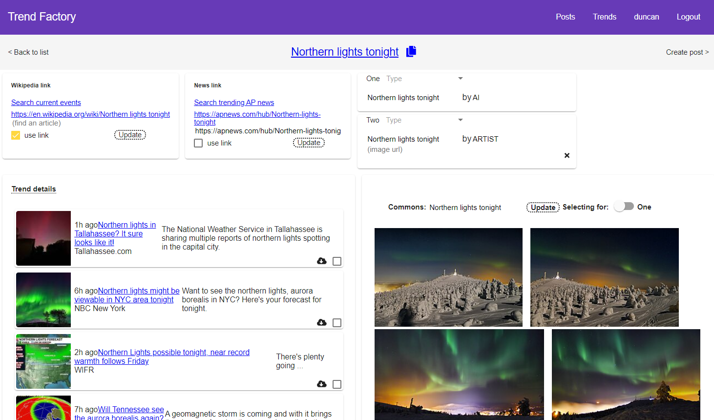
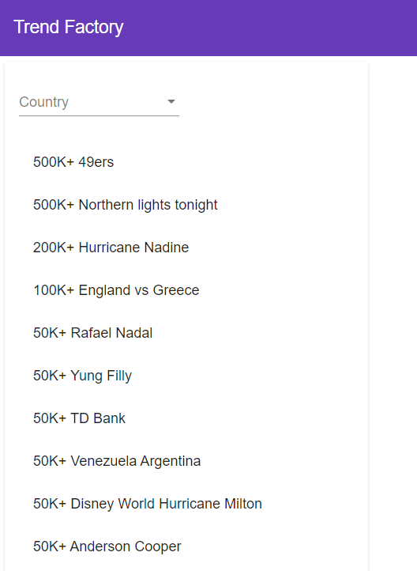
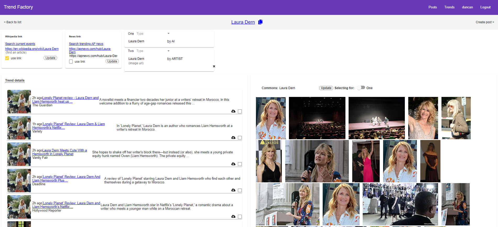
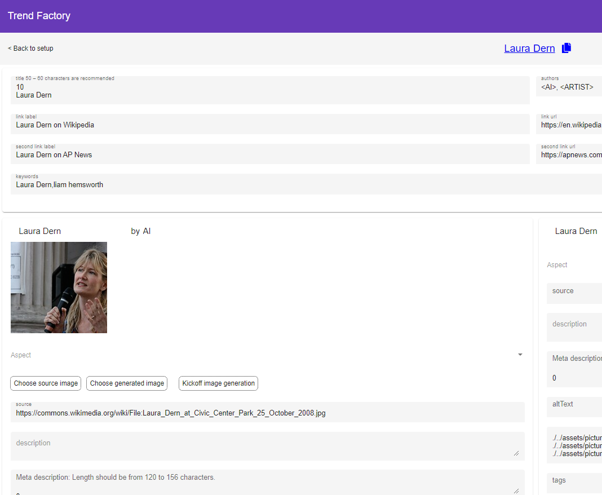
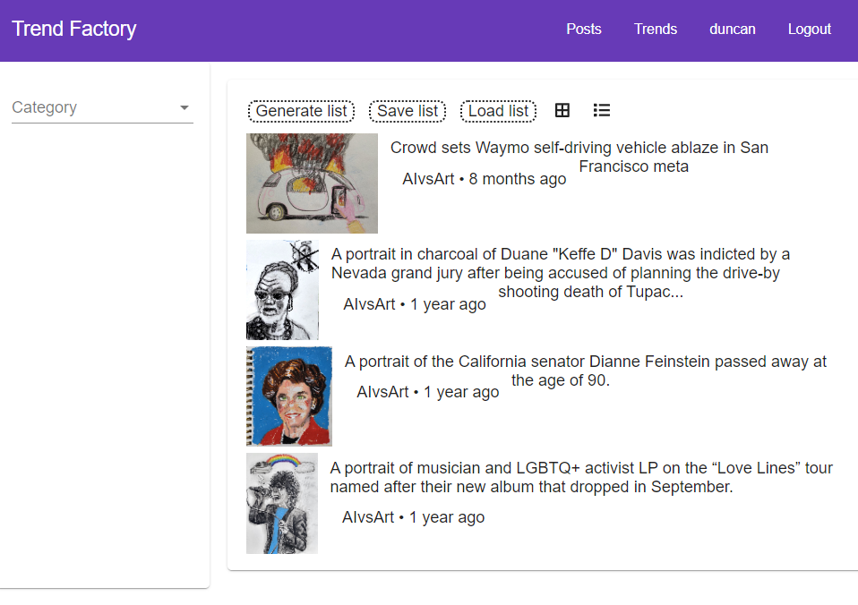

# The Trend Factory

This is a mono repo using Nx with an Angular frontend and a Nest.js backend that spawns Python processes to use pretrained ML models.  I facilitates the creation of short articles with images, content and links to subjects on AP news and Wikipedia.



This app using the [Enterprise Angular applications with NgRx and Nx](https://duncanhunter.gitbook.io/enterprise-angular-applications-with-ngrx-and-nx/introduction/2-creating-an-nx-workspace) pattern.  Currently it is run locally to construct posts for two different frontend sites.

There are various utilities to create links for content on AP News and WIkipedia.  It does a Wikimedia search for images related to the search trend and allows the user to select one or two images.  The initial purpose of the app was to create a kind of face-off between a real life artist and a machine learning GAN image.  These were posted on the site [AI vs Art](https://www.aivsart.com/) aka Tundra 64 which is hosted on Heroku.

The name Tundra 64 is derived from the original Heroku deployment URL.  It is tied to the GitHub [evening-tundra-07464](https://github.com/timofeysie/evening-tundra-07464) repo which holds the source code for the site.


The problem with the above site was that it was too slow for Search Engine Optimization (SEO) purposes.  Angular in general is not as performant for SEO, so I create a React project with the same capabilities, but that was also too slow and the pages were not able to be indexed by Google.  What did work was a Preact Server Side Generated (SSG) site based on Next.js.  It creates [Accelerated Mobile Pages (AMP)](https://amp.dev/) that perform well for SEO load in about a second.  To achieve the speed, AMP uses inline styles which means the them use for Tundra is much more difficult to achieve. This is currently only a technological demonstration, and the styles are very rudimentary compared to the Tundra site.

[Ruffmello.com](https://ruffmello.com/) Preact site site hosted on Netlify.

There is extensive documentation the records the development of all these features in the docs directory.  Given that the Javascript tech space moves on so quickly, it's all becomes legacy code very quickly.  Most likely some of the Nest.js code will live on in another project instead of continuing here.

Generally speaking it looks at current Google search trends and allows you to select a trend to create a post around.



Then the user can choose an image from Wikimedia, setup Wikipedia and AP News links as well as links for other news story sources.



Then the user can generate an image using the Toonify app which relies on a DCGAN pre-trained model.



The user can then generate a list of posts which can be used for publishing the articles.



Note the above content is from more recent content which is not ML generated.

## Workflow

```txt
nx serve nest-demo // start the nest server (this should be done from a regular Windows prompt)
npm run server // start the customer portal server
nx serve customer-portal // serve the front end with trends
nx serve trendy // original Tundra 64 app, now defunct
nx test auth // test the auth lib
nx test layout // test the layout lib
nx test products // test the products lib
nx test customer-portal // test the customer-portal app
nx e2e customer-portal-e2e // run the end-to-end tests
nx build customer-portal
nx build --prod customer-portal --stats-json   
npm run bundle-report-customer-portal
python apps\hugging-face\src\hello.py // run the text summary script
```

## API details

A trend search for the nest-demo looks like this:

```url
http://localhost:3333/api/images/Christina%20Applegate
```

A text search looks like this:

/api/text/:id, GET

```url
http://localhost:3333/api/text/Christina%20Applegate
```

It will write a file: array.txt

```url
Project Console: https://console.firebase.google.com/project/trendy2022/overview
Hosting URL: https://trendy2022.web.app
```

Run the server and then the customer-portal and the app will be served at: http://localhost:4200

You can also go directly to login: http://localhost:4200/auth/login

Use the following info from the server/db.json:

```json
"username": "duncan",
"password": "123"
```

After login, you should see the same JSON returned with the addition of a token property in the network tab.

## Setup

Clone the project and npm install the dependencies.

### Directories needed

These directories need to be created manually at the moment if they don't already exist.

```txt
- ./apps/toonify/src/cartooned_img/test_img
- ./apps/toonify/src/cartooned_img/gen_image
- ./apps/toonify/src/cartooned_img/cartooned_img
- ./apps/nest-demo/src/app/bart/summaries
- ./apps/nest-demo/src/app/gan/bucket
- ./articles/
- ./posts
- ./dist/apps/public # images downloaded from wikimedia commons
```

### AMP image rules

Max portrait height: 960px.
Max landscape height: 541px.

See the [Original README](docs/ORIGINAL_README.md) for more details on setup and the way the project was originally constructed.

## Original Nx Readme

This project was generated using [Nx](https://nx.dev).

<p style="text-align: center;"></p>

🔎 **Powerful, Extensible Dev Tools**

## Adding capabilities to your workspace

Nx supports many plugins which add capabilities for developing different types of applications and different tools.

These capabilities include generating applications, libraries, etc as well as the devtools to test, and build projects as well.

Below are our core plugins:

- [React](https://reactjs.org)
  - `npm install --save-dev @nrwl/react`
- Web (no framework frontends)
  - `npm install --save-dev @nrwl/web`
- [Angular](https://angular.io)
  - `npm install --save-dev @nrwl/angular`
- [Nest](https://nestjs.com)
  - `npm install --save-dev @nrwl/nest`
- [Express](https://expressjs.com)
  - `npm install --save-dev @nrwl/express`
- [Node](https://nodejs.org)
  - `npm install --save-dev @nrwl/node`

There are also many [community plugins](https://nx.dev/nx-community) you could add.

## Generate an application

Run `nx g @nrwl/react:app my-app` to generate an application.

> You can use any of the plugins above to generate applications as well.

When using Nx, you can create multiple applications and libraries in the same workspace.

## Generate a library

Run `nx g @nrwl/react:lib my-lib` to generate a library.

> You can also use any of the plugins above to generate libraries as well.

Libraries are shareable across libraries and applications. They can be imported from `@demo-app/mylib`.

## Development server

Run `nx serve my-app` for a dev server. Navigate to http://localhost:4200/. The app will automatically reload if you change any of the source files.

## Code scaffolding

Run `nx g @nrwl/react:component my-component --project=my-app` to generate a new component.

## Build

Run `nx build my-app` to build the project. The build artifacts will be stored in the `dist/` directory. Use the `--prod` flag for a production build.

## Running unit tests

Run `nx test my-app` to execute the unit tests via [Jest](https://jestjs.io).

Run `nx affected:test` to execute the unit tests affected by a change.

## Running end-to-end tests

Run `ng e2e my-app` to execute the end-to-end tests via [Cypress](https://www.cypress.io).

Run `nx affected:e2e` to execute the end-to-end tests affected by a change.

## Understand your workspace

Run `nx dep-graph` to see a diagram of the dependencies of your projects.

## Further help

Visit the [Nx Documentation](https://nx.dev) to learn more.

## ☁ Nx Cloud

### Computation Memoization in the Cloud

<p style="text-align: center;"></p>

Nx Cloud pairs with Nx in order to enable you to build and test code more rapidly, by up to 10 times. Even teams that are new to Nx can connect to Nx Cloud and start saving time instantly.

Teams using Nx gain the advantage of building full-stack applications with their preferred framework alongside Nx’s advanced code generation and project dependency graph, plus a unified experience for both frontend and backend developers.

Visit [Nx Cloud](https://nx.app/) to learn more.
